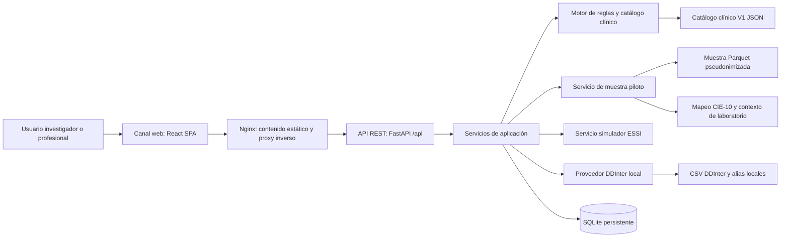

# Estado actual de SIGRAM-AM

**Proyecto:** SIGRAM-AM — Piloto de investigación  
**Entorno descrito:** desarrollo local `sigram-am-dev`  
**Ubicación:** `D:\ESSALUD\Proyectos\SIGRAM_PILOTO_GITHUB - DEV`  
**Fecha de corte:** 19 de agosto de 2026  
**Estado:** prototipo de investigación; no apto para decisiones clínicas directas.

---

## 1. Definición de SIGRAM

**SIGRAM-AM** es un sistema web de soporte a la revisión farmacoterapéutica de personas adultas mayores con polifarmacia. Su finalidad es realizar un **tamizaje trazable** de riesgos potenciales de prescripción a partir de los medicamentos, diagnósticos, exámenes y contexto clínico disponibles.

El sistema no reemplaza el juicio clínico ni emite una prescripción. Identifica criterios candidatos, muestra la evidencia usada, señala datos faltantes y deja el resultado disponible para la revisión de un profesional de salud.

El flujo clínico-operativo es:

```text
Medicamentos y datos clínicos disponibles
                ↓
Normalización y vínculo con catálogo clínico V1
                ↓
Evaluación de criterios Beers, STOPP/START e interacciones DDInter
                ↓
Resultado trazable: hallazgo / información adicional / sin hallazgo /
clasificación de apoyo / no aplicable / revisión clínica
```

El piloto se enfoca en pacientes de **60 años o más**, con observación histórica durante **2025**. La definición operativa de polifarmacia usada en la preparación de la cohorte es cinco o más medicamentos únicos activos el mismo día. Los criterios AGS Beers 2023 fueron elaborados originalmente para 65 años o más; por ello, la aplicación a 60–64 años se conserva como adaptación explícita del protocolo.

---

## 2. Propósito y meta actual

### Propósito del producto

1. Apoyar la identificación consistente de prescripciones potencialmente inapropiadas y riesgos farmacoterapéuticos.
2. Hacer visible la evidencia y la lógica que sustentan cada resultado.
3. Preparar una integración futura con datos institucionales de ESSI, evitando redigitación cuando esos datos estén disponibles.
4. Servir como plataforma de investigación y validación clínica preliminar.

### Meta actual

La meta vigente es consolidar y validar un **prototipo local de investigación** para el tamizaje de Beers, STOPP/START y DDInter con casos pseudonimizados/simulados. El siguiente hito metodológico es contrastar los resultados de SIGRAM con la revisión de expertos clínicos y validar los mapeos, excepciones, datos requeridos y reglas automatizadas antes de una integración institucional real.

No es todavía meta del sistema demostrar reducción de hospitalizaciones, reacciones adversas o mortalidad; ello requeriría una evaluación de impacto posterior.

---

## 3. Alcance funcional actual

| Función | Estado actual |
|---|---|
| Casos del piloto | Lista y evaluación de 10 pacientes pseudonimizados de 2025. |
| Casos nuevos | Creación de casos simulados y evaluación sin afectar la cohorte fuente. |
| Simulador longitudinal | Caso `SIM-ESSI-001`, copia controlada de un paciente piloto, con historia de actualizaciones auditable y restauración a línea base. |
| Medicamentos | Catálogo V1 de 54 medicamentos priorizados; permite agregar medicamentos, dosis, unidad, frecuencia, vía y duración. |
| Historia farmacológica piloto | Los medicamentos históricos se muestran separadamente como “Medicamentos en uso”; las modificaciones de pacientes piloto son temporales y se descartan. |
| Datos de triaje piloto | Registro manual de peso, talla, creatinina sérica y fecha de creatinina para pruebas. Calcula IMC en la interfaz y CrCl en backend. |
| Función renal | Cálculo de depuración de creatinina (CrCl) con Cockcroft–Gault y peso corporal actual cuando se informa edad, sexo, peso y creatinina. Se conserva fuente, método e insumos. |
| Beers | 23 criterios B01–B23 vinculados al catálogo V1. |
| STOPP/START | 74 criterios vinculados al catálogo V1 (53 STOPP y 21 START). |
| Interacciones | Consulta local de ocho archivos CSV de DDInter; no consume un servicio DDInter externo. |
| Trazabilidad | Evidencia activadora, protectores, excepciones, datos faltantes, versión/regla y resultados de cada ejecución. |
| Historial | Persistencia local de casos simulados, evaluaciones, alertas y eventos del simulador ESSI. |
| API técnica | Documentación OpenAPI/Swagger y ReDoc disponibles en el backend. |

### Lógica Beers relevante implementada

- El medicamento no genera una alerta por sí solo: primero habilita uno o varios criterios candidatos, y luego se evalúa la condición clínica correspondiente.
- B03 se maneja como clasificación auxiliar de anticolinérgico fuerte; no constituye un hallazgo clínico independiente. Puede aportar evidencia a B18 u otros criterios clínicos.
- Para enfermedades crónicas sin evidencia positiva en la fuente histórica, determinados criterios como B06, B13 y B21 se clasifican como **no aplicables** y no como “faltan datos obligatorios”, de acuerdo con la política metodológica del piloto.
- B08, B19 y B20 pueden aprovechar la CrCl calculada con Cockcroft–Gault cuando el usuario registra los insumos de triaje/laboratorio del piloto.
- La ausencia de un diagnóstico CIE-10 no se interpreta como ausencia de enfermedad. Las condiciones crónicas se consideran únicamente cuando existe evidencia positiva documentada.

---

## 4. Arquitectura lógica general



La separación actual sigue una arquitectura por capas:

| Capa | Responsabilidad | Implementación actual |
|---|---|---|
| Presentación | Navegación, formularios, resultados, filtros y detalles | React + TypeScript + CSS propio. |
| Entrega web | Servir la aplicación y direccionar solicitudes API | Nginx. |
| API | Endpoints HTTP, validación de solicitudes y contratos | FastAPI + Pydantic + OpenAPI. |
| Aplicación | Orquestar casos, evaluación, muestra y simulador | Servicios Python. |
| Dominio clínico | Aplicar reglas, catálogo, contexto, excepciones y trazabilidad | `RuleEngine`, `ClinicalCatalogService`, servicios renal, diagnósticos, laboratorio y normalización. |
| Infraestructura | Persistencia, lectura de fuentes locales y contenedores | SQLAlchemy/SQLite, Polars, DuckDB para preparación/auditoría offline, Docker Compose. |

---

## 5. Frontend / canal web

### Tipo de canal

SIGRAM actualmente opera como una **aplicación web de página única (SPA)**. El usuario accede desde un navegador web; no existe aplicación móvil nativa, escritorio nativo, canal WhatsApp, chatbot ni integración de mensajería.

### Tecnología frontend

| Componente | Tecnología / versión fijada | Uso |
|---|---:|---|
| Framework | React 18.3.1 | Componentes y estado de la interfaz. |
| Lenguaje | TypeScript 5.7.2 | Tipado de datos y contratos de cliente. |
| Herramienta de compilación | Vite 8.2.0 | Desarrollo y compilación del frontend. |
| Paquete React/Vite | `@vitejs/plugin-react` 6.0.5 | Compilación React con Vite. |
| Estilos | CSS propio | Diseño visual y componentes de la interfaz. |
| Servidor web | Nginx 1.27 Alpine | Publicación del contenido estático y proxy hacia la API. |
| Contenedor de construcción | Node.js 22 Alpine | Instalación y compilación del frontend. |

### Funciones principales de la interfaz

- Casos del piloto y ejecución de tamizaje.
- Formulario de caso nuevo/simulado.
- Carga temporal de historias de los 10 pacientes piloto.
- Simulador ESSI persistente con historial de atenciones.
- Registro piloto de peso, talla, creatinina y fecha del resultado.
- Tabla de medicamentos, catálogo clínico controlado y medicamentos históricos desplegables.
- Formulario de contexto clínico opcional.
- Resultados separados en Beers, STOPP/START y DDInter.
- Vista resumida de hallazgos y sección ampliada de trazabilidad, datos faltantes, resultados no aplicables y clasificaciones de apoyo.
- Consulta de historial de ejecuciones de casos simulados y página de validación de datos.

### Comunicación frontend–backend

El frontend utiliza `fetch` y contratos JSON sobre **HTTP/REST**. Nginx recibe las solicitudes con prefijo `/api/` y las reenvía internamente al contenedor FastAPI. No se usan GraphQL, gRPC, SOAP, WebSockets ni Server-Sent Events.

---

## 6. Backend

### Tecnología backend

| Componente | Tecnología / versión fijada | Uso |
|---|---:|---|
| Lenguaje y contenedor base | Python 3.11 Slim | Ejecución de la API. |
| Framework API | FastAPI 0.111.0 | API REST, OpenAPI, Swagger y ReDoc. |
| Servidor ASGI | Uvicorn 0.30.1 | Servidor HTTP de la aplicación Python. |
| Contratos/validación | Pydantic 2.7.4 y pydantic-settings 2.3.4 | Esquemas de entrada/salida y configuración. |
| ORM | SQLAlchemy 2.0.31 | Acceso y persistencia relacional. |
| Procesamiento de Parquet | Polars 1.42.1 | Lectura de la muestra pseudonimizada. |
| Consulta/preparación offline | DuckDB 1.5.3 | Preparación y auditoría de datos; no es una dependencia del flujo web por solicitud. |
| Pruebas | Pytest 8.2.2, HTTPX 0.27.0 | Pruebas unitarias e integración de API. |

### Interfaces API REST actuales

| Grupo | Endpoints principales | Función |
|---|---|---|
| Salud | `GET /health` | Verificar disponibilidad de API y base local. |
| Casos | `/api/cases` | Crear, previsualizar, listar, consultar y eliminar casos simulados. |
| Evaluaciones | `/api/cases/{id}/evaluate`, resultados y ejecuciones | Ejecutar tamizaje y recuperar reportes. |
| Catálogo | `/api/catalog/v1/*` | Exponer resumen, medicamentos y criterios del catálogo V1. |
| Piloto | `/api/pilot/v1/*` | Listar, precargar, obtener datos de investigación y evaluar los 10 pacientes pseudonimizados. |
| Simulador ESSI | `/api/simulator/essi` | Leer, actualizar y restablecer `SIM-ESSI-001`. |
| Documentación | `/docs`, `/redoc` | Swagger/OpenAPI y ReDoc. |

### Organización de backend

```text
SIGRAM_AM_BACKEND_V1_20260805/
├── backend/app/
│   ├── api/             # Endpoints FastAPI
│   ├── schemas/         # Contratos Pydantic
│   ├── services/        # Lógica de aplicación y dominio
│   ├── repositories/    # Acceso a datos SQLAlchemy
│   ├── models/          # Tablas y relaciones ORM
│   ├── config.py        # Variables de configuración
│   ├── database.py      # Motor SQLite y sesiones
│   └── main.py          # Inicio y registro de routers
├── backend/tests/       # Suite de pruebas automatizadas
└── data/                # Catálogos, mapeos y muestra piloto
```

### Servicios de aplicación y dominio

| Servicio / componente | Responsabilidad |
|---|---|
| `CaseService` | Crea y administra casos simulados con sus medicamentos y contexto. |
| `EvaluationService` | Orquesta una evaluación, persiste ejecución y alertas, y arma el reporte. |
| `RuleEngine` | Evalúa reglas técnicas y la lógica de interacciones disponible. |
| `ClinicalCatalogService` | Evalúa criterios Beers y STOPP/START vinculados al catálogo clínico V1. |
| `MedicationNormalizer` | Normaliza principios activos para las evaluaciones. |
| `PilotSampleService` | Lee la muestra Parquet, selecciona el episodio farmacológico de mayor solapamiento y construye la precarga del caso. |
| `DiagnosisContextService` | Convierte evidencia CIE-10 positiva documentada en contexto clínico trazable. |
| `LabContextService` | Usa resultados de laboratorio aceptados según mapeo y control de unidad/fecha. |
| `RenalFunctionService` | Calcula CrCl Cockcroft–Gault para el flujo piloto sin reemplazar un valor documentado. |
| `DDInterCsvProvider` | Busca interacciones en CSV locales y aplica alias locales versionados. |
| `EssiSimulatorService` | Mantiene el caso persistente de demostración ESSI y sus instantáneas históricas. |

---

## 7. Arquitectura de datos y base de datos

### Base de datos operacional actual

La base operacional es **SQLite** local, persistida en el volumen Docker `sigram_backend_data_dev`. Es adecuada para el prototipo, pruebas y una baja concurrencia; no es la opción objetivo para producción institucional ni para procesamiento masivo concurrente.

### Entidades persistentes

| Tabla | Propósito | Relaciones principales |
|---|---|---|
| `clinical_cases` | Casos simulados: código, edad, sexo, diagnósticos, contexto y estado. | Un caso tiene medicamentos, ejecuciones e historial de simulación. |
| `medications` | Medicamentos vinculados a un caso: nombre, principio activo, dosis, frecuencia, vía y duración. | Pertenece a un caso. |
| `evaluation_executions` | Cada ejecución: tiempos, éxito, conteos y reporte técnico completo. | Pertenece a un caso y tiene alertas. |
| `alerts` | Hallazgos persistidos: regla, severidad, medicamentos, recomendación, fuente, versión y trazabilidad. | Pertenece a una ejecución. |
| `simulation_history_events` | Instantáneas y notas de cada actualización o restablecimiento de `SIM-ESSI-001`. | Pertenece al simulador. |

Las claves foráneas de SQLite se habilitan explícitamente. La eliminación de un caso simulado elimina de forma encadenada sus medicamentos, evaluaciones, alertas e historial asociado.

### Fuentes y artefactos de datos

| Recurso | Uso actual |
|---|---|
| `clinical_catalog_v1.json` | Catálogo clínico versionado: 54 medicamentos, 23 Beers, 53 STOPP y 21 START. |
| `top_medications_v1.csv` | Representación tabular del catálogo priorizado. |
| CSV de DDInter | Ocho grupos de datos locales para la detección provisional de interacciones. |
| `ddinter_name_aliases.csv` | Homologación local de nombres hacia DDInter; pendiente de validación institucional/ATC. |
| `cie10_clinical_context_v1.json` | Mapeo versionado de evidencia CIE-10 a contexto clínico permitido. |
| Parquet de muestra | Pacientes, medicamentos, laboratorios y diagnósticos pseudonimizados de 10 casos. |
| Parquet institucionales grandes | Se usan para preparar/auditar la cohorte, no se consultan en cada solicitud del entorno web actual. |

### Datos institucionales de referencia disponibles en el trabajo previo

- Cohorte de adultos mayores: 1,185,657 pacientes únicos de 60 años o más.
- Cohorte piloto con polifarmacia preparada: 733,564 pacientes.
- Resultados de exámenes disponibles en fuente: 278,872,980 registros.
- Muestra de aplicación: 10 pacientes pseudonimizados, 132 registros diagnósticos y 70 códigos CIE-10 distintos.

Estos valores describen las fuentes de preparación y no implican que el entorno web actual procese toda esa magnitud de datos en línea.

---

## 8. Motor clínico y trazabilidad

### Sistemas evaluados

1. **AGS Beers 2023:** 23 códigos B01–B23, adaptados operativamente al catálogo V1.
2. **STOPP/START:** 74 criterios vinculados al mismo catálogo controlado.
3. **DDInter:** pares de medicamentos con datos locales DDInter, con nivel desconocido excluido por defecto.

El catálogo suma 97 criterios; 40 tienen una primera automatización y 57 permanecen sujetos a contexto adicional, revisión clínica o expansión de reglas. El sistema distingue el hallazgo clínico visible del reporte técnico completo.

### Estados de criterio expuestos

- Activado/hallazgo clínico.
- Requiere información adicional.
- Sin hallazgo en los datos observados.
- Revisión clínica.
- No aplicable.
- Clasificación de apoyo.

Cada criterio puede exponer medicamentos implicados, evidencia activadora, datos faltantes, datos protectores, excepción/mitigación, acciones sugeridas, fuente y resumen de la lógica. Esto facilita la auditoría clínica de falsos positivos, falsos negativos y cobertura de datos.

---

## 9. Despliegue actual de desarrollo

El entorno de esta carpeta se despliega con Docker Compose bajo el nombre de proyecto `sigram-am-dev`.

| Servicio | Función | Exposición actual |
|---|---|---|
| `frontend` | Nginx con la SPA compilada | `http://127.0.0.1:8089` |
| `backend` | API FastAPI/Uvicorn | `http://127.0.0.1:8002` |
| Volumen `sigram_backend_data_dev` | Persistencia SQLite del prototipo | No expuesto por red. |

Los puertos están enlazados a `127.0.0.1`; por tanto este entorno de desarrollo **no está accesible desde otros equipos de la red local**. Es independiente del entorno estable que utiliza otro Docker/puerto.

### Componentes de software requeridos en el servidor

Para ejecutar la versión Docker actual se requiere:

- Sistema operativo compatible con Docker Engine/Docker Desktop (Windows, Linux o macOS con virtualización disponible).
- Docker Engine/Compose v2.
- Acceso local al código, catálogos, archivos de muestra y Dockerfiles.
- Capacidad para construir imágenes desde Python 3.11 Slim, Node.js 22 Alpine y Nginx 1.27 Alpine.
- Navegador web moderno para utilizar la interfaz.

No se requiere instalar Python, Node.js, Nginx, SQLite ni DuckDB directamente en el host si se usa Docker; están contenidos en las imágenes o dependencias del proyecto.

---

## 10. Requerimientos de conectividad, APIs, IA y autenticación

### Conectividad externa actual

| Elemento | Estado actual |
|---|---|
| Consumo de APIs externas en ejecución | No. Las interacciones DDInter se consultan en CSV locales. |
| Acceso a ESSI | No integrado. La aplicación usa datos de prueba/pseudonimizados y simulación. |
| Internet para operar una vez construidas las imágenes | No es necesario para el uso local normal. Puede ser necesario para la primera construcción si las imágenes/dependencias no están en caché. |
| Base de datos externa | No. SQLite es local en el volumen Docker. |
| SSO institucional | No implementado. |
| Autenticación / roles | No implementados. |
| WebSockets | No utilizados. |
| IA generativa o modelos de machine learning | No utilizados. |

SIGRAM actual funciona con reglas explícitas, catálogos y datos estructurados; **no utiliza inteligencia artificial para generar diagnósticos, recomendaciones o alertas**.

### Requerimientos para una futura integración institucional

La integración con ESSI requerirá, como mínimo:

1. Un mecanismo institucional autorizado de identificación del paciente y autenticación (idealmente SSO).
2. API, vista segura o capa de integración para obtener medicamentos, diagnósticos, resultados de laboratorio y triaje.
3. Mapeos validados ESSI → principio activo → ATC/DDInter y ESSI → analito/unidad clínica.
4. Comunicación cifrada HTTPS/TLS, gestión de secretos y control de acceso por roles.
5. Auditoría de accesos y de decisiones/consultas realizadas por el sistema.
6. Validación de privacidad, retención, respaldo y gobierno de datos conforme a la normativa institucional.

---

## 11. Capacidad referencial inicial

Los valores siguientes son una referencia de planificación para el **piloto local**; no sustituyen pruebas de carga ni una evaluación de infraestructura institucional.

| Escenario | vCPU | RAM | Disco útil | Observación |
|---|---:|---:|---:|---|
| Desarrollo individual actual | 2 | 4 GB | 15–20 GB | Suficiente para los dos contenedores, imágenes, base SQLite y muestra reducida. |
| Piloto con varios revisores y datos de muestra | 4 | 8 GB | 40–80 GB | Recomendado para mayor estabilidad, registros, respaldos y reconstrucciones. |
| Integración institucional / múltiples usuarios | Por dimensionar con prueba de carga | Por dimensionar | Base de datos y almacenamiento administrados | Requiere base de datos servidor, seguridad, observabilidad y escalamiento. |

La capacidad final depende de número de usuarios concurrentes, tamaño de la cohorte consultada, periodicidad de actualización, retención de auditorías y diseño de la integración ESSI. La lectura de Parquet institucionales grandes no debe ocurrir completa por cada solicitud web; para producción se requiere una capa de consulta por paciente/fecha e índices adecuados.

---

## 12. Avances implementados

### Plataforma y despliegue

- Separación entre entorno estable y entorno de desarrollo mediante Docker Compose, puertos y volumen independientes.
- Frontend web funcional y backend API REST integrados por Nginx.
- Health checks para backend y frontend.
- Persistencia local aislada para el entorno `sigram-am-dev`.

### Backend y datos

- Capas API, esquemas, servicios, repositorios, modelos y persistencia separadas.
- Catálogo clínico V1 versionado con fuente y trazabilidad.
- Muestra pseudonimizada de 10 pacientes para evaluación controlada.
- Selección del episodio farmacológico de mayor solapamiento, evitando mezclar todas las dispensaciones de 2025.
- Uso de evidencia CIE-10 positiva sin convertir la ausencia de código en una negación clínica.
- Contexto de laboratorio trazable con controles de fecha, unidad, analito y fuente.
- Cálculo Cockcroft–Gault para la etapa piloto, conservando los insumos usados.
- Caso simulador ESSI persistente e historial de actualizaciones, sin alterar la cohorte fuente.

### Lógica clínica

- Refactorización de la lógica Beers para separar clasificación, condición clínica, datos faltantes, excepciones y protectores.
- B03 tratado como clasificación anticolinérgica de apoyo, no como alerta independiente.
- Política de no mostrar como brecha los criterios dependientes de enfermedades crónicas cuando no hay evidencia positiva histórica, para los criterios definidos en el piloto.
- Evaluación diferenciada de combinaciones, duración, protectores y excepciones en criterios automatizados.
- Separación visual entre hallazgos clínicos y análisis técnico ampliado.

### Calidad técnica

- Suite automatizada vigente con **127 pruebas** para reglas, APIs, persistencia, laboratorios, casos piloto, endurecimiento básico y simulador.
- Imágenes Docker reproducibles mediante versiones de dependencias fijadas.
- Uso de claves foráneas y restricciones básicas en SQLite.

---

## 13. Dificultades, limitaciones y riesgos actuales

### Clínicos y de datos

1. El catálogo V1 cubre 54 medicamentos, no el universo de medicamentos institucionales.
2. Solo 40 de 97 criterios poseen automatización inicial; el resto requiere más información o revisión clínica.
3. El mapeo ESSI–principio activo–ATC–DDInter es provisional y debe validarse contra el maestro institucional.
4. Los diagnósticos CIE-10 aportan evidencia positiva, pero no permiten inferir gravedad, síntomas, adherencia, fragilidad, caídas, cognición, hipotensión ortostática o indicación terapéutica.
5. La muestra de 10 pacientes sirve para prueba y validación preliminar, no para calcular prevalencias representativas ni rendimiento clínico definitivo.
6. La cobertura de laboratorio y la semántica de campos institucionales todavía requieren validación clínica e institucional.
7. Algunas detecciones START requieren rediseño, porque identificar una omisión terapéutica no siempre puede partir de un medicamento presente.

### Técnicas y operativas

1. SQLite no es adecuada para concurrencia institucional, alta disponibilidad o volumen masivo.
2. No existen migraciones formales de base de datos (por ejemplo, Alembic).
3. No hay autenticación, autorización, SSO, auditoría de accesos ni gestión centralizada de secretos.
4. Swagger, ReDoc y health check no deben exponerse públicamente en producción sin protección.
5. No hay monitoreo centralizado, métricas operativas, alertamiento ni pruebas de carga.
6. No hay paginación, búsqueda avanzada ni procesamiento por lotes para cohortes grandes.
7. El uso actual es HTTP local; para integración o red institucional será necesario HTTPS/TLS y controles de red.
8. La configuración del backend contiene documentación histórica que debe mantenerse alineada con la versión real de frontend, Python y despliegue para evitar confusión.

---

## 14. Requerimientos y hoja de ruta recomendada

### Prioridad clínica y metodológica

1. Validar con el equipo médico las 40 reglas automatizadas, sus umbrales, protectores, excepciones y acciones sugeridas.
2. Realizar validación preliminar con 3–5 expertos, comparando resultados de SIGRAM y revisión clínica estructurada.
3. Documentar los falsos positivos, falsos negativos y datos que más impiden evaluar un criterio.
4. Validar los mapeos de laboratorio, diagnósticos y medicamentos con ESSI.
5. Definir formalmente la regla histórica para enfermedades crónicas y su alcance por criterio.

### Prioridad de integración ESSI

1. Diseñar contrato de integración seguro para medicamentos, triaje, creatinina, diagnósticos y demás datos clínicos.
2. Reemplazar los campos manuales de piloto por autocompletado desde ESSI cuando la integración esté disponible; mantenerlos solo como modo de prueba controlada si se decide.
3. Definir fuente oficial y periodicidad de actualización de datos.
4. Implementar SSO, roles, auditoría, cifrado TLS y gestión de secretos antes de consultar información identificable.

### Prioridad técnica de producción

1. Migrar de SQLite a una base de datos de servidor, preferentemente PostgreSQL, con respaldos y alta disponibilidad según necesidad institucional.
2. Implementar migraciones versionadas, transacciones atómicas y estrategia de concurrencia.
3. Añadir paginación, búsqueda por paciente autorizada y procesamiento por lotes controlado.
4. Incorporar observabilidad: logs estructurados, métricas, trazas, monitoreo de salud y alertas.
5. Ejecutar pruebas de carga y dimensionar CPU, RAM, base de datos y almacenamiento según usuarios y volumen real.

---

## 15. Seguridad, privacidad y uso responsable

- El proyecto debe usar únicamente datos simulados o pseudonimizados mientras permanezca en el entorno de investigación.
- Las alertas son apoyo al tamizaje y requieren revisión por un profesional de salud.
- No debe emplearse el prototipo para decisiones clínicas directas.
- Los archivos institucionales grandes no deben subirse a repositorios públicos, enviarse por correo o copiarse fuera de canales autorizados.
- Una instalación institucional con datos identificables requiere evaluación formal de privacidad, seguridad, acceso, retención y auditoría.

---

## 16. Resumen ejecutivo

SIGRAM-AM es un prototipo web local de soporte a la revisión farmacoterapéutica en adultos mayores con polifarmacia. Actualmente integra una interfaz React, Nginx, una API REST FastAPI, servicios de reglas clínicas y una base SQLite local. Evalúa Beers, STOPP/START y DDInter a partir de un catálogo V1, una muestra pseudonimizada y datos clínicos disponibles, conservando trazabilidad de la evidencia y las limitaciones.

El proyecto ha logrado un entorno de piloto reproducible, simulación de historia farmacológica, cálculo renal Cockcroft–Gault para pruebas y una lógica clínica más explícita para Beers. Aún necesita validación clínica, homologación con ESSI, autenticación, seguridad institucional, base de datos de servidor, observabilidad y pruebas de carga antes de plantear una puesta en producción.
