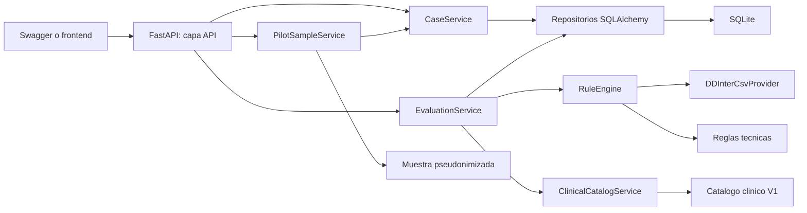
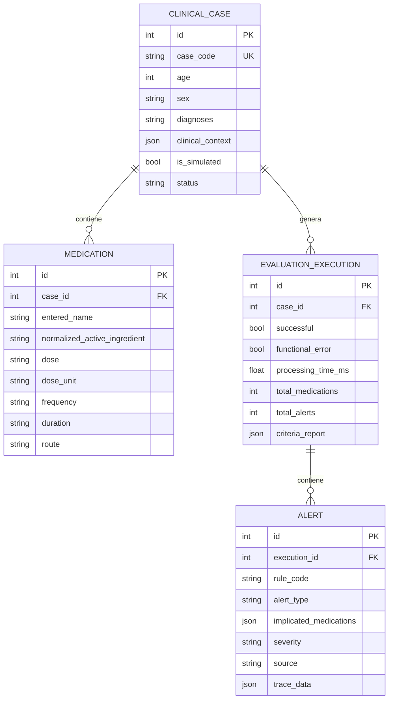
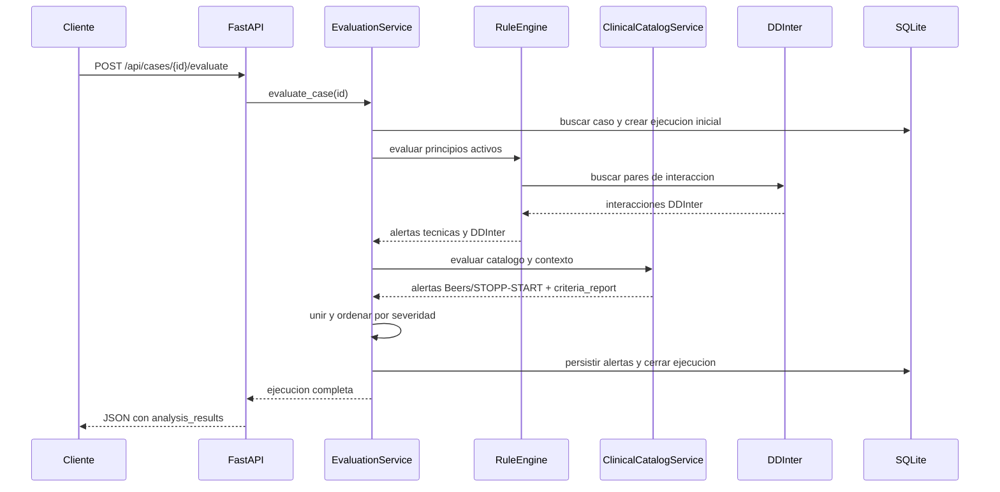

# Documentacion tecnica del backend SIGRAM-AM V1

Version documentada: `1.0.0`  
Fecha: 2026-08-07  
Estado: prototipo de investigacion

> SIGRAM-AM V1 es un sistema de tamizaje para apoyar la revision
> farmacoterapeutica. No esta validado para tomar decisiones asistenciales.
> Toda alerta requiere revision por un profesional de salud.

## 1. Resumen ejecutivo

El backend es una API REST desarrollada con FastAPI. Permite:

- registrar casos simulados de pacientes de 60 anios o mas;
- registrar sus medicamentos y contexto clinico disponible;
- ejecutar tres analisis separados: Beers, STOPP/START y DDInter;
- devolver el analisis tecnico completo y vistas derivadas para el frontend;
- persistir casos, ejecuciones y alertas en SQLite;
- consultar resultados anteriores;
- listar y evaluar una muestra pseudonimizada de 10 pacientes del piloto 2025;
- exponer contratos OpenAPI/Swagger que pueden ser consumidos por un frontend.

El backend no permite todavia buscar cualquier paciente directamente en
`cohorte.parquet` o `sigram.parquet`. Esos archivos grandes se usaron para
preparar la cohorte y la muestra, pero no se consultan en cada solicitud.

## 2. Alcance clinico V1

| Elemento | Alcance actual |
|---|---|
| Poblacion | Pacientes de 60 anios o mas |
| Periodo piloto | 2025 |
| Polifarmacia | Al menos 5 medicamentos unicos activos el mismo dia |
| Beers | Catalogo V1 reducido al top de 54 medicamentos |
| STOPP/START | Catalogo V1 reducido al top de 54 medicamentos |
| DDInter | Ocho CSV locales de grupos A, B, D, H, L, P, R y V |
| Persistencia | SQLite local |
| Interfaz actual | Swagger; frontend grafico pendiente |

Beers 2023 fue disenado para poblacion de 65 anios o mas. Para pacientes de
60 a 64 anios el backend conserva `age_scope: protocol_adaptation_60_64`, de
modo que esta adaptacion pueda identificarse y justificarse en el protocolo.

## 3. Arquitectura general



La aplicacion esta separada en capas:

1. `api`: recibe HTTP y valida parametros.
2. `schemas`: define contratos Pydantic de entrada y salida.
3. `services`: contiene la logica de aplicacion y los motores de reglas.
4. `repositories`: encapsula las consultas y escrituras SQLAlchemy.
5. `models`: define las tablas y relaciones persistentes.
6. `data`: contiene SQLite local, catalogos y fuentes del piloto.

## 4. Tecnologias utilizadas

| Tecnologia | Version fijada | Funcion |
|---|---:|---|
| Python | 3.12 | Lenguaje del backend |
| FastAPI | 0.111.0 | API REST y OpenAPI |
| Uvicorn | 0.30.1 | Servidor ASGI |
| Pydantic | 2.7.4 | Validacion de contratos |
| pydantic-settings | 2.3.4 | Variables de configuracion |
| SQLAlchemy | 2.0.31 | ORM y persistencia |
| SQLite | Incluido con Python | Base local del prototipo |
| Polars | 1.42.1 | Lectura de la muestra Parquet |
| DuckDB | 1.5.3 | Preparacion y auditoria offline de datos |
| Pytest | 8.2.2 | Pruebas automatizadas |
| HTTPX | 0.27.0 | Cliente usado por las pruebas de API |

Las versiones se encuentran fijadas en `backend/requirements.txt` para que el
entorno sea reproducible.

## 5. Estructura de archivos

```text
backend/
|-- app/
|   |-- api/
|   |   |-- health.py          # estado del servicio y BD
|   |   |-- cases.py           # CRUD de casos simulados
|   |   |-- evaluations.py     # ejecutar y recuperar evaluaciones
|   |   |-- catalog.py         # catalogo y disponibilidad de fuentes
|   |   `-- pilot.py           # muestra pseudonimizada V1
|   |-- models/
|   |   `-- models.py          # tablas SQLAlchemy
|   |-- repositories/
|   |   |-- case_repository.py
|   |   `-- evaluation_repository.py
|   |-- schemas/
|   |   |-- cases.py
|   |   |-- evaluations.py
|   |   |-- pilot.py
|   |   `-- responses.py
|   |-- services/
|   |   |-- case_service.py
|   |   |-- evaluation_service.py
|   |   |-- rule_engine.py
|   |   |-- clinical_catalog_service.py
|   |   |-- ddinter_csv_provider.py
|   |   |-- medication_normalizer.py
|   |   `-- pilot_sample_service.py
|   |-- config.py
|   |-- database.py
|   `-- main.py
|-- data/
|   `-- sigram_poc.db          # se crea localmente; no se entrega en ZIP
|-- tests/
`-- requirements.txt
```

Archivos externos utilizados por el backend:

```text
data/catalogs/v1/clinical_catalog_v1.json
data/mappings/ddinter_name_aliases.csv
data/raw/ddinter2/ddinter_downloads_code_*.csv
data/processed/v1_handoff/sample_patients.parquet
data/processed/v1_handoff/sample_medications.parquet
data/processed/v1_handoff/sample_labs_2025.parquet
data/processed/v1_handoff/sample_diagnoses_2025.parquet
```

## 6. Configuracion

La configuracion esta en `backend/app/config.py`. Puede modificarse mediante
un archivo `.env` en la raiz del proyecto.

| Variable | Valor predeterminado | Uso |
|---|---|---|
| `APP_NAME` | `SIGRAM-AM` | Nombre de la API |
| `APP_VERSION` | `1.0.0` | Version reportada |
| `APP_ENV` | `development` | Entorno |
| `DATABASE_URL` | `sqlite:///backend/data/sigram_poc.db` | Conexion SQLAlchemy |
| `API_PREFIX` | `/api` | Prefijo configurado |
| `DDINTER_DATA_DIR` | `data/raw/ddinter2` | Directorio de CSV DDInter |
| `DDINTER_ALIAS_FILE` | `data/mappings/ddinter_name_aliases.csv` | Alias locales |
| `DDINTER_INCLUDE_UNKNOWN` | `false` | Incluir interacciones Unknown |
| `CLINICAL_CATALOG_FILE` | `data/catalogs/v1/clinical_catalog_v1.json` | Catalogo Beers/STOPP-START |
| `REFERENCE_CATALOG_FILE` | `data/catalogs/reference/pharmacologic_groups_cie10_20260818.json` | Grupos farmacológicos ampliados y descripciones CIE-10 |
| `SIGRAM_ENGINE_RANKING_FILE` | `data/processed/engine_patient_ranking_rebagliati_2025.json` | Ranking persistente calculado por el motor para los 200 candidatos |
| `PILOT_COHORT_FILE` | `data/raw/cohorte.parquet` | Fuente completa de cohorte |
| `PILOT_LABS_FILE` | `data/raw/sigram.parquet` | Fuente completa de laboratorios |
| `PILOT_DIAGNOSES_FILE` | `.../atenmed.parquet` | Fuente de atenciones y CIE-10 |
| `PILOT_SAMPLE_DIR` | `data/processed/v1_handoff` | Muestra de 10 pacientes |
| `PILOT_LAB_LOOKBACK_DAYS` | `365` | Ventana retrospectiva piloto para laboratorios |
| `CIE10_CONTEXT_MAPPING_FILE` | `data/mappings/cie10_clinical_context_v1.json` | Mapeo auditable CIE-10 a contexto |
| `PILOT_DIAGNOSIS_LOOKBACK_DAYS` | `365` | Ventana retrospectiva piloto para diagnosticos |

El archivo `.env.example` contiene una plantilla. Las rutas son relativas a la
raiz del proyecto; por eso el servidor debe iniciarse desde esa ubicacion.

`API_PREFIX` existe, pero actualmente no se aplica de manera global: los
routers escriben `/api` directamente. `APP_ENV` solo se muestra en `/health` y
no activa por si mismo controles de produccion.

## 7. Fuentes de datos y uso real

### 7.1 Archivos institucionales grandes

| Archivo | Contenido | Uso actual en tiempo de ejecucion |
|---|---|---|
| `data/raw/cohorte.parquet` | 1,185,657 pacientes de 60+; 26,516,536 bytes | Solo se verifica que exista |
| `data/raw/sigram.parquet` | 278,872,980 resultados; 2,678,416,680 bytes | Solo se verifica que exista |
| `atenmed.parquet` | 10,801,766 atenciones; 369,120,254 bytes | Fuente principal CIE-10 para regenerar muestra |

El endpoint `GET /api/pilot/v1/sources` usa `Path.is_file()`. No abre ni carga
estos Parquet. Si no estan presentes devuelve HTTP 503 indicando las fuentes
faltantes.

La cohorte de polifarmacia fue preparada anteriormente con SQL/DuckDB. De los
1,185,657 pacientes de 60+, 733,564 quedaron en la cohorte piloto con
polifarmacia y los filtros definidos para 2025.

### 7.2 Muestra pseudonimizada

El backend si lee en tiempo de ejecucion estos archivos pequenos:

- `sample_patients.parquet`: edad, sexo y codigo pseudonimizado;
- `sample_medications.parquet`: dispensaciones del top de 54;
- `sample_labs_2025.parquet`: examenes crudos sin identificador institucional;
- `sample_diagnoses_2025.parquet`: 132 registros, 70 CIE-10 distintos y los
  10 pacientes, sin identificador institucional.

La muestra contiene 10 pacientes. No existe una tabla para revertir los
codigos `PILOT-...` al identificador institucional original.

`LabContextService` convierte exclusivamente identidades ESSI permitidas a
`ClinicalContext`: TFG reportada directamente, potasio, sodio, TSH, T4 libre
cuando su propio rango es interpretable y proteinuria de 24 horas. Exige codigo
de examen, analito y unidad compatibles; para TFG exige tambien la descripcion
`DOSAJE DE CREATININA EN SANGRE`. No calcula TFG desde creatinina.

Para el piloto actual, la seleccion usa retrospectivamente el ultimo resultado
aceptado dentro del ano calendario 2025 completo. La fecha indice se usa para
definir la exposicion farmacologica, no para recortar los examenes del piloto.
Los valores fuera de 2025, no numericos, ambiguos o con unidad no permitida no
se aplican. El contexto manual tiene prioridad. Cada seleccion conserva procedencia, fecha, valor crudo, hash
de fila, regla de derivacion y banderas de calidad. `VALID_RESULT` se conserva,
pero no se interpreta porque falta su diccionario institucional.

Cada evidencia informa `temporal_relation_to_medication_index` y
`used_under_pilot_full_year_rule`. Esto permite distinguir evidencia anterior,
simultanea o posterior a la fecha indice sin perder la regla retrospectiva del
piloto.

`DiagnosisContextService` lee los CIE-10 ligados a atenciones de
`atenmed.parquet`, ya pseudonimizados en la muestra. Para este piloto usa los
codigos documentados entre 2025-01-01 y 2025-12-31 y cuenta frecuencia, primera
y ultima atencion. El archivo `cie10_clinical_context_v1.json` declara los prefijos
permitidos y su version.

La semantica es exclusivamente evidencia positiva. Un codigo directo puede
completar antecedentes como ulcera peptica, fibrilacion auricular, artrosis u
osteoporosis. La ausencia de codigo nunca genera `false`. Diagnosticos generales
se conservan como apoyo sin completar campos mas exigentes: `N18` no sustituye
TFGe, `I50` no define estado sintomatico o fraccion de eyeccion, `J44` no define
gravedad y `N40` no confirma sintomas urinarios. La procedencia queda en
`clinical_context.diagnosis_provenance` y
`criteria_report[].diagnosis_evidence`.

### 7.3 Catalogo clinico V1

`clinical_catalog_v1.json` fue derivado del Excel medico priorizado. Contiene:

- 54 medicamentos;
- 23 criterios Beers;
- 53 criterios STOPP y 21 START;
- 74 criterios STOPP/START en conjunto;
- 97 criterios en total;
- 40 criterios con una primera automatizacion V1;
- 57 criterios manuales o dependientes de contexto.

El catalogo conserva la version, archivo fuente, SHA-256, ubicacion del
criterio, formulacion operativa y medicamentos asociados.

### 7.3.1 Como se aplican combinaciones, protectores y excepciones

El motor no decide solamente por coincidencia textual. La coincidencia con el
Excel determina que criterios son candidatos; despues se evalua una condicion
estructurada que puede usar:

- medicamento o grupo farmacologico implicado;
- medicamentos concomitantes;
- duracion y dosis del medicamento especifico, no la maxima de todo el caso;
- resultados de laboratorio anteriores o iguales a la fecha indice;
- antecedentes CIE-10 positivos anteriores o iguales a la fecha indice;
- contexto clinico manual;
- medicamento protector o coprescripcion requerida;
- excepciones documentadas por el medico.

La respuesta de cada criterio expone:

| Campo | Contenido |
|---|---|
| `triggering_evidence` | Medicamentos, combinaciones y contexto que activaron la regla |
| `protective_evidence` | IBP, laxante, acido folico u otra proteccion encontrada |
| `exception_status` | Excepcion aplicada, parcial, desconocida, no cumplida o no aplicable |
| `exception_reason` | Explicacion legible del estado de la excepcion |
| `recommended_actions` | Opciones de revision o datos que se deben obtener |
| `logic_summary` | Resumen de la decision del motor |
| `medication_coverage_note` | Advertencia de que la lista automatica solo cubre el top V1 |

Ejemplos implementados:

- Beers B05: un AINE de mas de 90 dias, o un AINE programado junto con
  corticoide sistemico, anticoagulante o antiagregante, genera alerta salvo que
  esten documentados tanto el fallo de alternativas mas seguras como la
  gastroproteccion. El umbral de 90 dias es una decision operativa V1 pendiente
  de ratificacion medica.
- Beers B16: opioide con gabapentina/pregabalina genera alerta; la transicion
  desde el opioide o la reduccion de su dosis puede aplicar la excepcion, pero
  se conserva la recomendacion de vigilar sedacion.
- STOPP-F5 y STOPP-H1: la presencia de un IBP —o de antagonista H2 cuando el
  criterio lo permite— cambia el resultado al reconocer la proteccion.
- STOPP-L2 y START-K2: se comprueba el laxante concomitante en uso regular de
  opioides.
- START-H9: se comprueba acido folico con metotrexato.
- Las reglas de pares o recuentos primero verifican la precondicion. Por
  ejemplo, STOPP-C4 no pide fibrilacion auricular si no existe simultaneamente
  antiagregante y anticoagulante.

La ausencia de un protector en la lista de 54 medicamentos no demuestra que el
paciente no lo reciba. Por eso el resultado indica
`protector_not_found_in_top_v1` y exige comprobar la lista farmacologica
completa. Del mismo modo, la ausencia de CIE-10 no se convierte en ausencia del
antecedente.

### 7.4 DDInter

DDInter utiliza ocho archivos CSV locales. No realiza consultas a Internet ni
a un servicio externo. El mapeo ESSI-DDInter disponible es provisional y esta
en `data/mappings/ddinter_name_aliases.csv`.

## 8. Modelo de datos persistente



### 8.1 Restricciones

- `ClinicalCase.age >= 60`.
- `is_simulated` debe ser verdadero.
- `case_code` es unico.
- Cada caso debe tener al menos un medicamento a nivel de contrato API.
- La severidad de una alerta solo puede ser `alta`, `moderada` o
  `advertencia`.
- Las relaciones usan eliminacion en cascada.
- Solo se permite eliminar casos simulados.

### 8.2 Inicializacion y migracion minima

Al iniciar FastAPI, `init_db()` crea tablas faltantes. Para bases antiguas de
la prueba de concepto tambien agrega, si faltan:

- `clinical_cases.clinical_context`;
- `evaluation_executions.criteria_report`.

No se utiliza Alembic todavia.

## 9. Contrato de un caso clinico

Un caso contiene:

- `case_code`: identificador unico del caso simulado;
- `age`: entero mayor o igual a 60;
- `sex`: texto;
- `diagnoses`: texto o codigos CIE-10;
- `clinical_context`: datos clinicos estructurados opcionales;
- `is_simulated`: siempre `true`;
- `medications`: uno o mas medicamentos.

Ejemplo:

```json
{
  "case_code": "PRUEBA-MANUAL-001",
  "age": 75,
  "sex": "Mujer",
  "diagnoses": "I10, E11",
  "clinical_context": {
    "egfr_ml_min_1_73m2": 25,
    "falls_history": true,
    "indication_confirmed": true
  },
  "is_simulated": true,
  "medications": [
    {
      "entered_name": "Alprazolam 0.5 mg",
      "normalized_active_ingredient": "ALPRAZOLAM",
      "dose": "0.5",
      "dose_unit": "mg",
      "frequency": "diaria",
      "duration": "30 dias",
      "route": "oral"
    }
  ]
}
```

La normalizacion actual elimina espacios sobrantes y convierte el principio
activo a mayusculas. No infiere sinonimos clinicos. Los sinonimos DDInter se
mantienen en un CSV explicito y auditable.

## 10. Contexto clinico disponible

`ClinicalContext` acepta, entre otros:

### Laboratorio y mediciones

- `egfr_ml_min_1_73m2`;
- `potassium_mmol_l`;
- `sodium_mmol_l`;
- `corrected_calcium_mmol_l`;
- `tsh_miu_l`;
- `free_t4_normal`;
- `proteinuria_mg_24h`;
- presion sistolica y diastolica;
- frecuencia cardiaca, QTc y BMI.

### Evaluacion geriatrica y funcional

- `falls_history`;
- `frailty_status`;
- `cognitive_impairment`;
- `delirium`;
- `orthostatic_hypotension`;
- `syncope_history`;
- `adherence_known`;
- `indication_confirmed`.

### Antecedentes y condiciones

Incluye insuficiencia cardiaca, ulcera peptica, riesgo de sangrado,
fibrilacion auricular, enfermedad vascular, estrenimiento, EPOC, insuficiencia
respiratoria, osteoartrosis, enfermedad hepatica, osteoporosis, sintomas
urinarios y otras variables requeridas por criterios V1.

Tambien admite excepciones y medidas de mitigacion documentadas, entre ellas:
`opioid_transition_or_dose_reduction`, `acute_severe_pain`,
`ppi_maintenance_indication`, `safer_alternatives_ineffective`,
`lithium_level_monitoring`, `potassium_monitoring` y `gastroprotection`.

### Datos por medicamento

`medication_facts` puede incluir:

```json
{
  "active_ingredient": "ALPRAZOLAM",
  "duration_days": 30,
  "daily_dose_mg": 0.5,
  "indication": "ansiedad",
  "regular_use": true
}
```

El esquema acepta campos adicionales (`extra="allow"`) para facilitar la
evolucion del prototipo. Esto debe endurecerse antes de produccion.

## 11. Flujo completo de evaluacion



Pasos detallados:

1. Se busca el caso por ID.
2. Se valida que exista, sea simulado y tenga medicamentos.
3. Se crea una `EvaluationExecution` con `successful=false`.
4. `RuleEngine` ejecuta controles tecnicos y DDInter.
5. `ClinicalCatalogService` ejecuta Beers y STOPP/START.
6. Se unen las alertas y se ordenan: alta, moderada, advertencia.
7. Cada alerta recibe `execution_id`, `case_id` y fecha en `trace_data`.
8. Se persisten alertas y `criteria_report`.
9. La ejecucion se cierra con tiempo, totales y estado.

Si ocurre un error inesperado se realiza rollback de la operacion actual, se
intenta marcar la ejecucion como fallida y se devuelve HTTP 500 sin exponer
detalles internos.

## 12. Motores de reglas

### 12.1 Reglas tecnicas

`RuleEngine` conserva controles de la prueba de concepto:

- `REG-POLY-001`: cinco o mas medicamentos recibidos;
- `REG-DUP-001`: principio activo normalizado repetido;
- combinaciones sinteticas de `DemoInteractionProvider` usadas para regresion.

Estas alertas no pertenecen a Beers, STOPP/START ni DDInter. Su
`analysis_system` es `cohort_eligibility` o `technical_demo`.

La regla tecnica `REG-POLY-001` cuenta filas recibidas, no principios activos
unicos. La definicion epidemiologica de la cohorte si usa medicamentos unicos
simultaneos; esta diferencia debe corregirse antes de usar la regla tecnica
como clasificador de elegibilidad.

Por ese motivo `total_alerts` puede ser mayor que la suma de las tres salidas
clinicas. Un frontend debe usar `analysis_results` o `analysis_system`.

### 12.2 Beers y STOPP/START

El servicio:

1. compara los medicamentos del caso contra los 54 medicamentos del catalogo;
2. obtiene los codigos candidatos asociados a las coincidencias;
3. identifica los campos requeridos por cada criterio;
4. evalua las reglas automatizadas si los datos estan completos;
5. publica el resultado tecnico completo en `criteria_report`;
6. deriva `clinical_findings`, `data_gaps` y `manual_review_findings`.

Estados posibles:

| Estado | Significado |
|---|---|
| `alert` | La condicion automatizada V1 fue encontrada |
| `no_alert` | El criterio pudo evaluarse y la condicion no fue encontrada |
| `not_evaluable` | Faltan uno o mas datos obligatorios |
| `manual_review` | Hay coincidencia, pero la regla requiere criterio clinico o no esta automatizada |

Un dato ausente nunca se convierte automaticamente en un resultado negativo.
El frontend muestra `clinical_findings` por defecto y conserva los otros
estados bajo "Ver mas". El backend no elimina informacion de auditoria.

Todas las alertas clinicas Beers/STOPP-START usan por ahora severidad generica
`advertencia`, pero la recomendacion ya se construye desde las acciones
especificas documentadas para la regla cuando estan disponibles.
`medication_duration_days` y `daily_dose_mg` se filtran por el medicamento
implicado; no se toma la duracion o dosis de otro farmaco del episodio.

### 12.3 DDInter

`DDInterCsvProvider`:

- lee archivos que coinciden con `ddinter_downloads_code_*.csv`;
- normaliza mayusculas y elimina tildes para comparar;
- aplica alias locales si existen;
- genera todas las combinaciones de pares de medicamentos;
- canoniza el orden del par;
- deduplica registros repetidos entre archivos;
- conserva el nivel mas grave cuando un par aparece varias veces;
- excluye `Unknown` salvo que se habilite por configuracion;
- guarda IDs, nivel y archivos de origen en `trace_data`.

Mapeo de severidad:

| Nivel DDInter | Severidad SIGRAM-AM |
|---|---|
| `Major` | `alta` |
| `Moderate` | `moderada` |
| `Minor` | `advertencia` |
| `Unknown` | `advertencia`, excluida por defecto |

Los CSV no incluyen mecanismo detallado ni conducta clinica. La recomendacion
es generica y exige confirmacion profesional.

Cobertura auditada del material local:

- 222,383 filas entre los ocho CSV;
- 160,235 pares canonicos unicos;
- 47,182 filas con nivel `Unknown`;
- son exportaciones clasicas/legacy, no una distribucion completa DDInter 2.0;
- faltan los grupos ATC C, G, J, M, N y S respecto de los 14 grupos principales.

Si faltan los CSV o el archivo de alias, el proveedor puede quedar con catalogo
vacio sin marcar un error de cobertura. Esto refuerza que cero alertas no es
equivalente a ausencia demostrada de interacciones.

## 13. Cargador de los 10 pacientes piloto

`PilotSampleService` evita cargar todas las dispensaciones de 2025 como si
fueran simultaneas.

Para cada paciente:

1. lee sus dispensaciones del top V1;
2. construye intervalos desde `fecha_despacho` hasta
   `fecha_despacho + duracion_dias - 1`;
3. usa cada fecha de inicio como candidata;
4. selecciona el dia con mayor numero de medicamentos unicos activos;
5. crea un caso simulado con ese episodio;
6. permite sustituir la seleccion automatica mediante `index_date` dentro de
   2025 y rechaza fechas sin medicamentos top activos;
7. aplica retrospectivamente laboratorios y CIE-10 aceptados de todo 2025;
8. agrega duracion a `medication_facts`;
9. ejecuta los tres motores y persiste el resultado.

La respuesta incluye:

- medicamentos distintos durante todo 2025;
- maximo de medicamentos del top simultaneos;
- fecha indice seleccionada;
- periodo clinico observable fijo: 2025-01-01 a 2025-12-31;
- presentacion ESSI, nombre evaluado, grupo farmacologico y codigos de criterio
  para cada medicamento activo;
- filas de laboratorio crudas, campos aplicados, filas rechazadas y futuros
  excluidos;
- evidencia de laboratorio en `clinical_context.lab_provenance` y, cuando una
  regla usa el campo, en `criteria_report[].lab_evidence`;
- conteos y evidencia CIE-10 en `diagnosis_code_counts`,
  `diagnosis_provenance`, `mapped_diagnosis_fields` y
  `criteria_report[].diagnosis_evidence`;
- campos clinicos aun no resueltos.

Solo se incluyen medicamentos pertenecientes al top V1. Un paciente puede
tener menos de cinco medicamentos cargados aunque haya sido elegible por
polifarmacia usando el universo completo de farmacia.

Cada llamada al endpoint crea un caso nuevo con un codigo similar a:

```text
TEST-PILOT-011DA2C70400CA24-06D0E03F
```

Esto permite comparar ejecuciones con distintos contextos clinicos.

## 14. Endpoints

Base local: `http://127.0.0.1:8000`

### 14.1 Estado y metadatos

| Metodo | Ruta | Funcion |
|---|---|---|
| GET | `/` | Nombre, version y advertencia |
| GET | `/health` | Estado del servicio y conexion a BD |

### 14.2 Catalogo y fuentes

| Metodo | Ruta | Funcion |
|---|---|---|
| GET | `/api/catalog/v1/summary` | Conteos, version y cobertura |
| GET | `/api/catalog/v1/medications` | Presentaciones, grupos y criterios de los 54 farmacos |
| GET | `/api/catalog/v1/criteria?system=beers` | Criterios y datos requeridos |
| GET | `/api/catalog/v1/criteria?system=stopp_start` | Criterios STOPP/START |
| GET | `/api/pilot/v1/sources` | Existencia de cohorte, laboratorios, atenmed y catalogo |

### 14.3 Muestra piloto

| Metodo | Ruta | Funcion |
|---|---|---|
| GET | `/api/pilot/v1/sample-patients` | Lista los 10 casos disponibles |
| POST | `/api/pilot/v1/sample-patients/{patient_code}/evaluate` | Carga y evalua un caso de muestra |

El cuerpo del POST es opcional. Puede incluir una fecha indice de 2025 y
contexto revisado manualmente:

```json
{
  "index_date": "2025-06-15",
  "clinical_context": {
    "egfr_ml_min_1_73m2": 25,
    "falls_history": true,
    "orthostatic_hypotension": false,
    "indication_confirmed": true
  }
}
```

### 14.4 Casos generales

| Metodo | Ruta | Funcion |
|---|---|---|
| POST | `/api/cases` | Crea un caso manual |
| GET | `/api/cases` | Lista casos sin detalle de medicamentos |
| GET | `/api/cases/{case_id}` | Obtiene un caso completo |
| DELETE | `/api/cases/{case_id}` | Elimina un caso simulado y sus dependencias |

### 14.5 Evaluaciones

| Metodo | Ruta | Funcion |
|---|---|---|
| POST | `/api/cases/{case_id}/evaluate` | Crea una nueva ejecucion |
| GET | `/api/cases/{case_id}/results` | Ultima ejecucion del caso |
| GET | `/api/executions/{execution_id}` | Ejecucion especifica |

### 14.6 Errores relevantes

| HTTP | Situacion |
|---:|---|
| 400 | Caso no simulado o operacion no permitida |
| 404 | Caso, paciente o ejecucion inexistente |
| 409 | `case_code` duplicado |
| 422 | Error de validacion o caso sin medicamentos |
| 503 | Faltan fuentes locales esperadas |
| 500 | Error interno controlado durante evaluacion |

## 15. Estructura de la respuesta de evaluacion

Campos principales:

| Campo | Descripcion |
|---|---|
| `id` | ID de ejecucion |
| `case_id` | Caso evaluado |
| `successful` | Ejecucion terminada correctamente |
| `processing_time_ms` | Tiempo del motor |
| `total_medications` | Medicamentos recibidos |
| `total_alerts` | Alertas clinicas y tecnicas persistidas |
| `alerts` | Alertas completas |
| `criteria_report` | Analisis tecnico completo Beers/STOPP/START |
| `clinical_findings` | Alertas resueltas para la vista principal |
| `data_gaps` | Criterios que requieren informacion adicional |
| `manual_review_findings` | Coincidencias que requieren revision profesional |
| `analysis_results` | Resumen separado de los tres sistemas |

Cada alerta contiene:

- codigo de regla;
- tipo y sistema de analisis;
- problema identificado;
- medicamentos implicados;
- severidad;
- recomendacion y justificacion;
- fuente y version;
- `trace_data` para auditoria.

`analysis_results` siempre contiene tres entradas:

- `beers` con estado `active_v1_screening_catalog`;
- `stopp_start` con estado `active_v1_screening_catalog`;
- `ddinter` con estado `active_local_legacy_catalog`.

Para Beers y STOPP/START, `criteria_report` conserva todos los estados.
`clinical_findings` filtra `alert`, `data_gaps` filtra `not_evaluable` y
`manual_review_findings` filtra `manual_review`. Estas propiedades tambien se
calculan al consultar ejecuciones historicas. DDInter informa sus pares mediante
`alerts` y `analysis_system`.

## 16. Instalacion

Requiere Python 3.12. No se debe copiar un entorno virtual de otra maquina.

```powershell
py -3.12 -m venv .venv
.\.venv\Scripts\python.exe -m pip install --upgrade pip
.\.venv\Scripts\python.exe -m pip install -r backend\requirements.txt
```

En esta maquina se creo `.venv-local` porque el `.venv` recibido conservaba
una ruta inexistente de otro equipo.

## 17. Ejecucion

Desde la raiz del proyecto:

```powershell
.\scripts\start_backend.ps1
```

El script intenta primero `.venv-local` y luego `.venv`.

Direcciones:

- API: `http://127.0.0.1:8000`;
- Swagger: `http://127.0.0.1:8000/docs`;
- ReDoc: `http://127.0.0.1:8000/redoc`;
- salud: `http://127.0.0.1:8000/health`.

Arranque manual:

```powershell
.\.venv\Scripts\python.exe -m uvicorn backend.app.main:app `
  --host 127.0.0.1 --port 8000 --reload
```

`--reload` es apropiado para desarrollo, no para produccion.

## 18. Pruebas

```powershell
.\.venv\Scripts\python.exe -m pytest backend\tests -q
```

Estado verificado: `113 passed`.

Las pruebas usan SQLite en memoria con `StaticPool`, reemplazan la dependencia
`get_db` y verifican que la base de desarrollo no cambie durante Pytest.

Cobertura funcional incluida:

- validacion y CRUD de casos;
- restricciones de edad y simulacion;
- persistencia y recuperacion de ejecuciones;
- reglas tecnicas;
- catalogo Beers/STOPP-START;
- estados y datos faltantes;
- DDInter y deduplicacion;
- endpoints de muestra y seleccion temporal;
- salud, errores y endurecimiento basico.

Prueba rapida de los pacientes:

```powershell
.\.venv\Scripts\python.exe scripts\try_sample_patients.py --list
.\.venv\Scripts\python.exe scripts\try_sample_patients.py `
  --patient-code PILOT-011DA2C70400CA24
```

## 19. Conexion con un frontend

La API tiene contratos OpenAPI suficientes para construir un primer frontend
de validacion con los 10 pacientes.

Flujo recomendado:

```text
GET /api/pilot/v1/sample-patients
  -> seleccionar patient_code
POST /api/pilot/v1/sample-patients/{patient_code}/evaluate
  -> mostrar evaluation.analysis_results
  -> separar alertas por analysis_system
  -> mostrar evaluation.clinical_findings
  -> dejar data_gaps y manual_review_findings bajo "Ver mas"
  -> mostrar data_availability.medication_catalog_classification
```

Ejemplo JavaScript:

```javascript
const patients = await fetch("/api/pilot/v1/sample-patients").then(r => r.json());

const result = await fetch(
  `/api/pilot/v1/sample-patients/${patients[0].patient_code}/evaluate`,
  {
    method: "POST",
    headers: { "Content-Type": "application/json" },
    body: JSON.stringify({ clinical_context: {} })
  }
).then(r => r.json());

console.log(result.evaluation.analysis_results);
```

El backend no configura CORS actualmente. Las opciones de desarrollo son:

1. configurar el frontend para enviar `/api` mediante un proxy a
   `http://127.0.0.1:8000`; o
2. agregar `CORSMiddleware` con origenes explicitamente permitidos.

No se recomienda permitir `*` en un entorno con datos clinicos.

El directorio `frontend/` esta vacio salvo `.gitkeep`. Swagger es la unica
interfaz incluida. Ademas, Uvicorn escucha solo en `127.0.0.1`; otro equipo no
puede conectarse sin una configuracion de despliegue, proxy, HTTPS y controles
de acceso.

Pantallas minimas sugeridas:

1. lista de pacientes de muestra;
2. resumen de episodio y disponibilidad de datos;
3. tres tarjetas separadas: Beers, STOPP/START y DDInter;
4. tabla de alertas;
5. detalle de presentacion ESSI y grupo farmacologico por medicamento;
6. formulario de contexto clinico manual;
7. historial de ejecuciones.

## 20. Trazabilidad y auditoria

Cada alerta persiste:

- regla y version;
- sistema de analisis;
- medicamentos normalizados e implicados;
- condicion evaluada;
- fuente del catalogo;
- caso y ejecucion;
- momento de evaluacion;
- datos especificos DDInter cuando corresponda.

El catalogo clinico y el ZIP de entrega cuentan con hashes SHA-256. Esto
permite verificar que los archivos usados no cambiaron entre ejecuciones.

## 21. Seguridad y privacidad

Estado actual:

- servidor enlazado a `127.0.0.1` por defecto;
- muestra pseudonimizada;
- casos obligatoriamente simulados;
- errores internos no se devuelven completos al cliente;
- claves foraneas SQLite activadas;
- eliminacion restringida a casos simulados.

Pendiente antes de un despliegue real:

- autenticacion y autorizacion;
- roles y permisos;
- registro de accesos;
- cifrado en transito;
- gestion segura de secretos;
- CORS restrictivo;
- limites de solicitudes;
- politica de retencion y eliminacion;
- evaluacion formal de privacidad;
- separacion de datos identificables y analiticos.

`/health`, Swagger, ReDoc y `/api/pilot/v1/sources` no estan protegidos. El
ultimo puede mostrar rutas locales. Esto es aceptable solo en el entorno local
actual.

Aunque la muestra este pseudonimizada, debe compartirse solo por canales
institucionales autorizados.

## 22. Limitaciones conocidas

### Datos

- No existe endpoint para buscar cualquier paciente en los Parquet grandes.
- El mapeo V1 de laboratorios es deliberadamente limitado y solo opera sobre la
  muestra. Falta validar `VALID_RESULT`, la ventana temporal y ampliar la
  homologacion institucional.
- La muestra de 10 pacientes no contiene TFG directa; el Parquet completo si
  contiene resultados TFG bajo el examen 82565.
- CIE-10 puede aportar algunos antecedentes, pero no demuestra ausencia de
  enfermedad ni sustituye gravedad, sintomas, mediciones o indicacion.
- Fragilidad, hipotension ortostatica, adherencia e indicacion requieren otras
  fuentes o captura manual; caidas/cognicion solo se completan si existe un
  codigo positivo permitido.
- El crosswalk medicamento ESSI -> principio activo -> ATC -> DDInter es
  provisional.
- La muestra contiene solo medicamentos del top V1, no todo el tratamiento.

### Reglas clinicas

- Solo 40 de 97 criterios tienen automatizacion inicial.
- El catalogo cubre 54 medicamentos, no el universo farmacologico.
- La deteccion START de omisiones requiere redisenar la seleccion de candidatos:
  una omision no siempre puede descubrirse partiendo de un medicamento que ya
  esta presente.
- Dos de las cuatro reglas START marcadas como automaticas son actualmente
  inalcanzables por esa seleccion: `START-B1` exige ausencia de antihipertensivo
  pero solo se vuelve candidata cuando uno hizo match; `START-H9` exige
  metotrexato presente y acido folico ausente, pero el codigo se candidatea
  desde acido folico presente. `START-F3` y `START-K2` si tienen un camino
  funcional en la V1.
- Beers en 60-64 es una adaptacion del protocolo.
- Un resultado DDInter de cero alertas puede significar ausencia de pares,
  falta de alias o falta de cobertura del grupo.
- Los niveles `Unknown` se excluyen por defecto.

### Arquitectura y operacion

- SQLite es adecuado para prototipo, no para concurrencia o procesamiento
  masivo.
- La persistencia de alertas realiza commits individuales; la evaluacion debe
  consolidarse en una sola transaccion antes de procesamiento masivo.
- No hay paginacion, busqueda avanzada ni endpoint por lotes.
- No hay autenticacion, CORS ni frontend incluido.
- No hay migraciones formales con Alembic.
- No existe todavia observabilidad centralizada ni metricas de produccion.
- Cada evaluacion de muestra crea un caso nuevo; el endpoint no es idempotente.
- Los cuatro Parquet pequenos se releen completos en cada operacion; es aceptable
  para 10 pacientes, no para la cohorte completa.

## 23. Como agregar un criterio clinico

Flujo recomendado:

1. validar el criterio y su formulacion con el equipo medico;
2. agregarlo al catalogo fuente y regenerar
   `clinical_catalog_v1.json`;
3. declarar sus datos obligatorios en `REQUIREMENTS`;
4. agregar el codigo a `AUTOMATED_CODES` solo si existe una regla implementada;
5. implementar la condicion en `_evaluate_automated`;
6. agregar pruebas positivas, negativas y con datos faltantes;
7. revisar `age_scope`, fuente y trazabilidad;
8. ejecutar las 113 pruebas mas las nuevas;
9. versionar catalogo, regla y hash.

No se debe convertir una ausencia de datos en `no_alert`.

## 24. Como agregar un alias DDInter

Editar `data/mappings/ddinter_name_aliases.csv`:

```csv
local_active_ingredient,ddinter_drug_name,status
NOMBRE_LOCAL,English DDInter Name,provisional
```

Luego:

1. confirmar el principio activo contra el maestro institucional/ATC;
2. verificar que el nombre DDInter exista en los CSV;
3. agregar una prueba del par esperado;
4. ejecutar la suite;
5. cambiar el estado del alias cuando sea validado.

No se deben agregar equivalencias inferidas sin evidencia auditable.

## 25. Proximos pasos recomendados

Orden tecnico sugerido:

1. construir un endpoint DuckDB de consulta por paciente y fecha indice;
2. devolver solo las filas del paciente solicitado, sin cargar los Parquet
   completos en memoria;
3. validar con ESSI y el medico la homologacion implementada, `VALID_RESULT` y
   el uso retrospectivo del ano calendario 2025;
4. validar los 40 criterios automatizados con el medico, en especial umbrales,
   excepciones y protectores;
5. redisenar el motor START para detectar omisiones;
6. completar el crosswalk ESSI-ATC-DDInter;
7. hacer atomica la persistencia de cada evaluacion;
8. agregar autenticacion, auditoria, CORS y paginacion;
9. construir el frontend de validacion;
10. realizar revision clinica de falsos positivos y de la cobertura observable
    antes de ampliar la muestra.

## 26. Entrega a otro desarrollador

Paquete preparado:

```text
handoff/SIGRAM_AM_BACKEND_V1_20260805.zip
handoff/SIGRAM_AM_BACKEND_V1_20260805.sha256.json
```

El ZIP incluye backend, pruebas, catalogos, DDInter y muestra pseudonimizada.
No incluye los Parquet institucionales grandes, `.venv` ni SQLite local.

Verificacion realizada desde una extraccion limpia:

```text
113 passed
```

El SHA-256 vigente debe consultarse en
`handoff/SIGRAM_AM_BACKEND_V1_20260805.sha256.json`, porque cambia cada vez que
se reconstruye el ZIP.

## 27. Archivos principales para continuar

| Tema | Archivo |
|---|---|
| Aplicacion FastAPI | `backend/app/main.py` |
| Mapeo de laboratorios | `backend/app/services/lab_context_service.py` |
| Mapeo de CIE-10 | `backend/app/services/diagnosis_context_service.py` |
| Catalogo de mapeo CIE-10 | `data/mappings/cie10_clinical_context_v1.json` |
| Configuracion | `backend/app/config.py` |
| Base de datos | `backend/app/database.py` |
| Casos | `backend/app/services/case_service.py` |
| Orquestacion | `backend/app/services/evaluation_service.py` |
| Reglas tecnicas/DDInter | `backend/app/services/rule_engine.py` |
| Beers y STOPP/START | `backend/app/services/clinical_catalog_service.py` |
| DDInter CSV | `backend/app/services/ddinter_csv_provider.py` |
| Muestra piloto | `backend/app/services/pilot_sample_service.py` |
| Contratos | `backend/app/schemas/` |
| Modelos persistentes | `backend/app/models/models.py` |
| Pruebas | `backend/tests/` |
| Arranque | `scripts/start_backend.ps1` |
| Prueba de pacientes | `scripts/try_sample_patients.py` |
